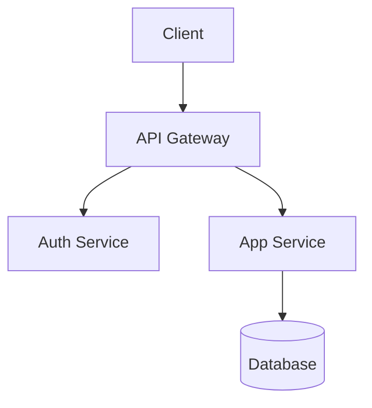

# plan.md 記入ガイド

## フェーズ分けの原則

| 原則 | 説明 |
|-----|------|
| 価値の早期提供 | 早いフェーズで価値を提供できる順序 |
| リスク管理 | 高リスクなタスクを早期に実施 |
| 依存関係 | 依存するタスクを先に完了 |
| テスト容易性 | テスト可能な単位で区切る |

## 成功基準の書き方

| 良い例 | 悪い例 |
|-------|--------|
| API応答時間が100ms以下 | パフォーマンスが良い |
| 単体テストカバレッジ80%以上 | テストを書く |
| 既存の全E2Eテストが通過 | 動作する |

## 選択肢比較の観点

| 観点 | 説明 |
|-----|------|
| 複雑度 | 実装・理解・保守のしやすさ |
| 開発工数 | 実装にかかる時間 |
| 移行コスト | 既存システムからの移行難易度 |
| 運用負荷 | 運用時の監視・対応の手間 |
| テスト容易性 | テストの書きやすさ |

## Mermaid 図ガイド

### 図の種類と選択基準

| 図の種類 | 用途 | 使う場面 |
|---------|------|---------|
| `graph TD` | コンポーネント構成・依存関係 | アーキテクチャ全体像、モジュール間依存 |
| `sequenceDiagram` | 時系列のやり取り | API呼び出しフロー、認証シーケンス |
| `stateDiagram-v2` | 状態遷移 | ライフサイクル管理、ワークフロー状態 |
| `erDiagram` | データモデル | DB設計、エンティティ関係 |

### Mermaid アンチパターン

| アンチパターン | 問題 | 対策 |
|--------------|------|------|
| 10ノード超の図 | 可読性が崩壊する | サブシステムごとに分割 |
| 双方向矢印の多用 | 依存方向が不明確になる | 単方向に整理し、双方向は注釈で説明 |
| 日本語ノード名 | レンダリング崩れのリスク | 英語ID + 日本語ラベル: `A[認証サービス]` |
| 過度な装飾 | 本質が見えなくなる | スタイルは最小限、構造で語る |
| 1図に複数の関心 | 何を伝えたいか不明 | 1図1メッセージの原則 |

### Mermaid 記述例

## 意思決定マトリクス

複数の選択肢を比較する際のテンプレート:

| 観点 | 重み | 選択肢A | 選択肢B | 選択肢C |
|------|------|---------|---------|---------|
| 複雑度 | 3 | 5 (15) | 3 (9) | 4 (12) |
| 開発工数 | 2 | 4 (8) | 5 (10) | 3 (6) |
| 移行コスト | 2 | 3 (6) | 4 (8) | 2 (4) |
| 運用負荷 | 1 | 4 (4) | 3 (3) | 5 (5) |
| **合計** | | **33** | **30** | **27** |

- **重み**: 1（低）〜 3（高）
- **評価**: 1（悪い）〜 5（良い）
- **括弧内**: 重み x 評価のスコア

## 設計書のアンチパターン

| アンチパターン | 具体例 | 改善方法 |
|--------------|--------|---------|
| 曖昧な表現 | 「適切に処理する」「必要に応じて対応」 | 具体的な処理内容・条件を記述 |
| 判断の丸投げ | 「実装者が最適な方法を選択」 | 推奨案を明記し、選定理由を添える |
| 全リスク「中」 | 影響度・発生確率が全て Medium | 相対比較で差をつける。全て同じなら評価基準を見直す |
| プレースホルダー放置 | `[TBD]` `[TODO]` が残存 | Phase 3.5 の検証で検出。未確定は `[NEEDS CLARIFICATION: 質問]` で明示 |
| 過剰な詳細 | 実装レベルのコードが設計書に | 設計書は What/Why、実装は How。コードは implementation.md へ |
| 選択肢なし | 推奨案のみで比較なし | 最低2つの選択肢を提示し、トレードオフを明示 |
| 不要なオプション | booleanパラメータやモード切替フラグを設計に含める | 振る舞いが異なるなら別コンポーネントに分離 |
| 予防的互換性 | 要求されていない後方互換性・フォールバックを追加 | 後方互換性は明示的要件がある場合のみ |
| 過剰な将来設計 | 「将来のため」の拡張ポイント・抽象化を含める | 今の要件だけを解決する設計にする |

## plan.md と ADR の使い分け

| ドキュメント | 用途 | タイミング |
|-------------|------|-----------|
| plan.md | 設計段階の提案・検討 | 実装前 |
| ADR | 確定した決定事項の記録 | 実装後 |

ワークフロー: `plan.md作成` → `実装` → `ADR作成`
