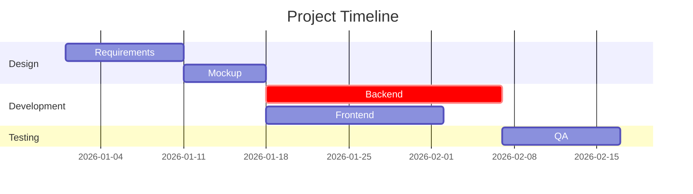
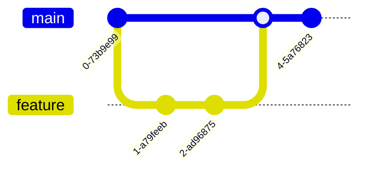
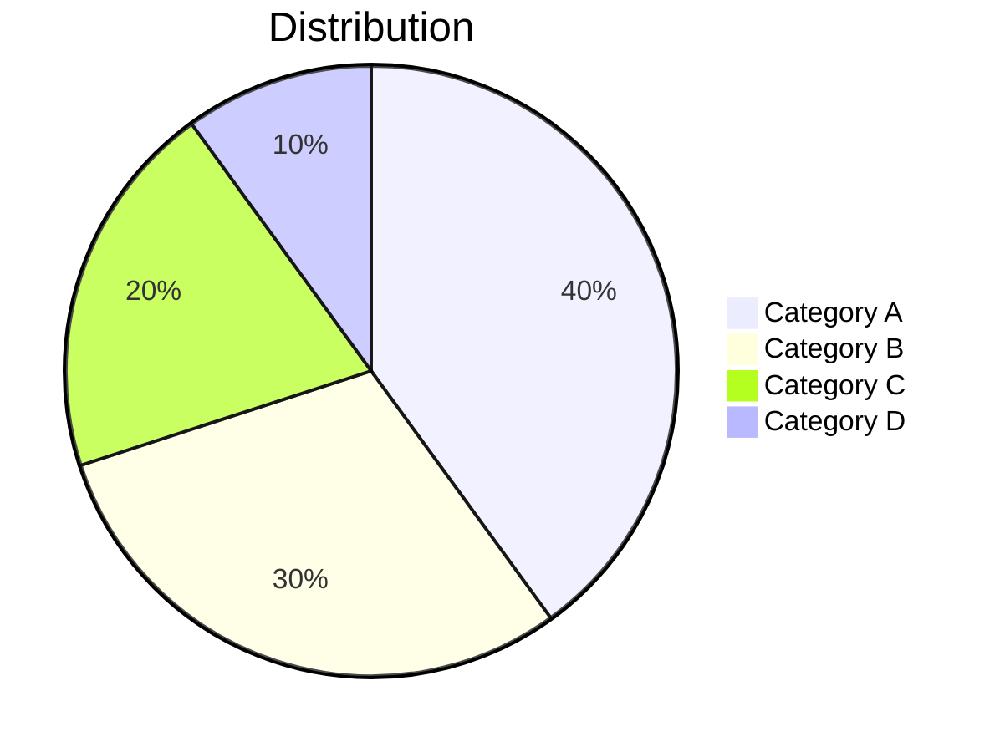
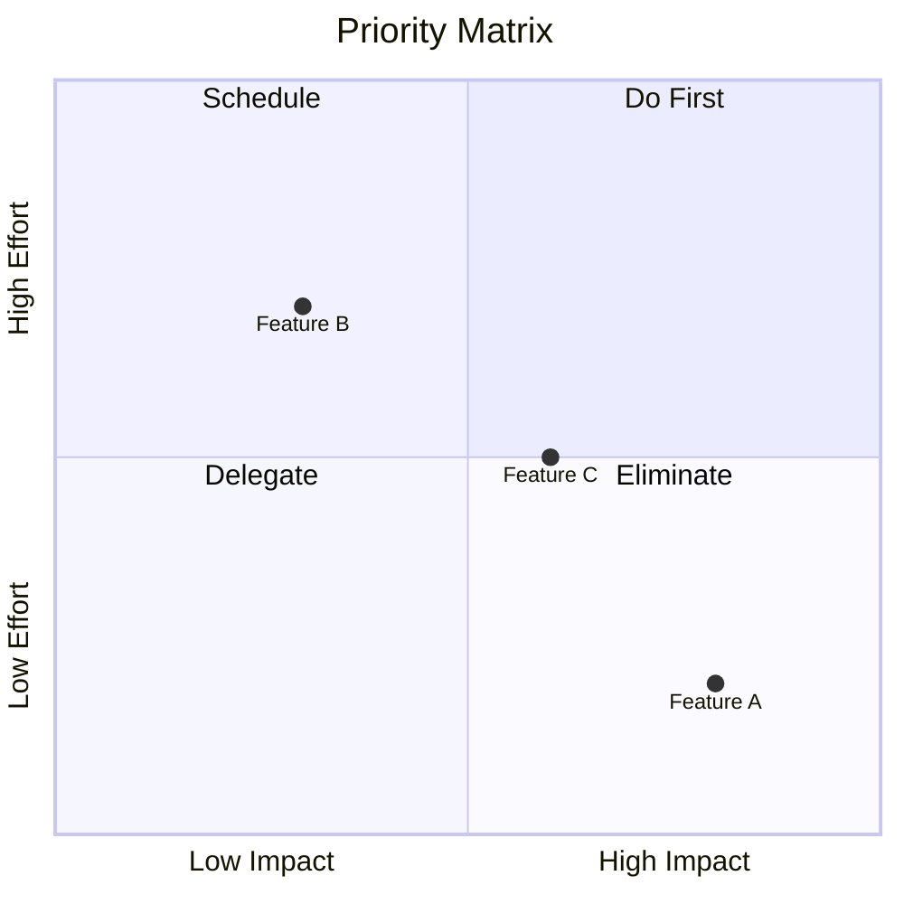
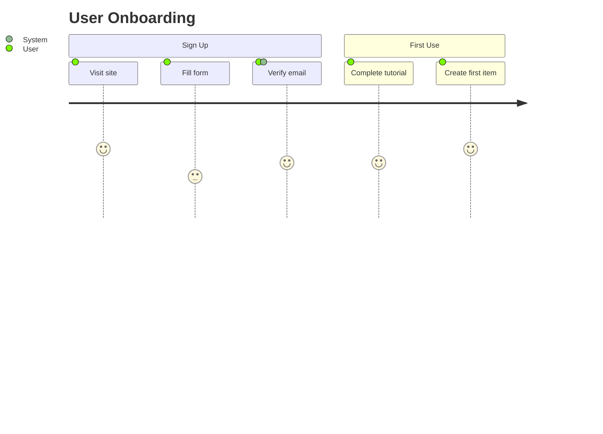
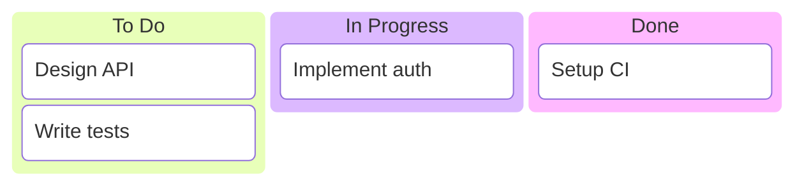
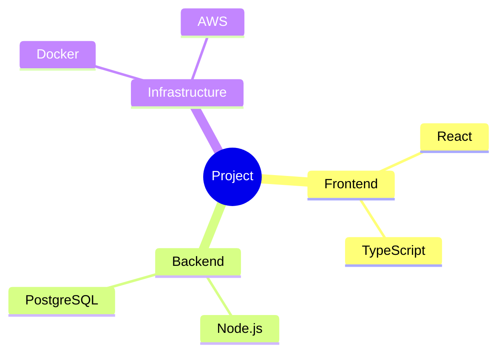
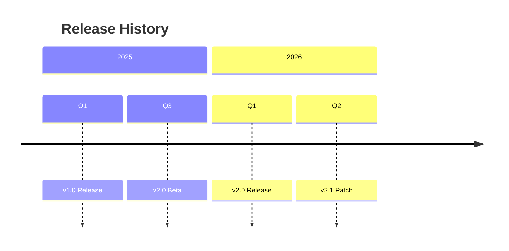
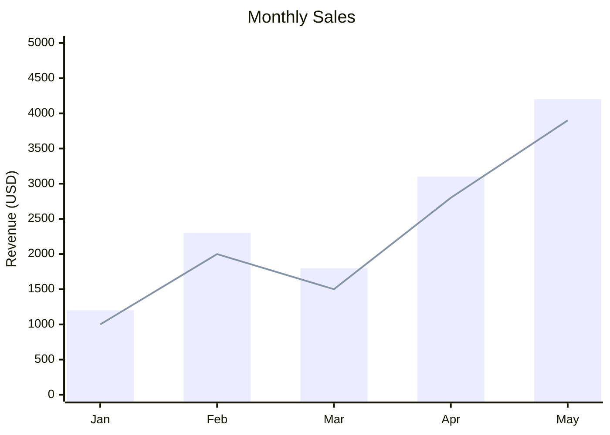
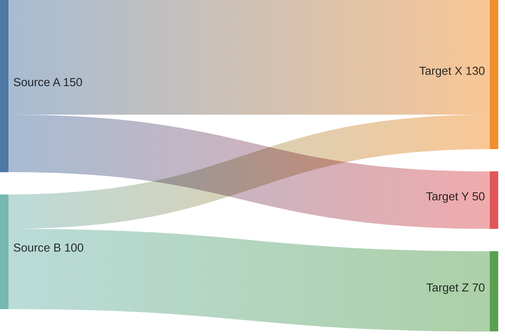

# Mermaid 高度・ニッチ図種別テンプレート

Gantt / Git Graph / Pie Chart および使用頻度の低い図種別のテンプレート集。

## Gantt Chart

## Git Graph

## Pie Chart

## Quadrant Chart

## User Journey

## Kanban

## Mindmap

## Timeline

## XY Chart

## Sankey Diagram

## Block Diagram

詳細は公式ドキュメントを参照（ベータ機能のため構文変更の可能性あり）。
