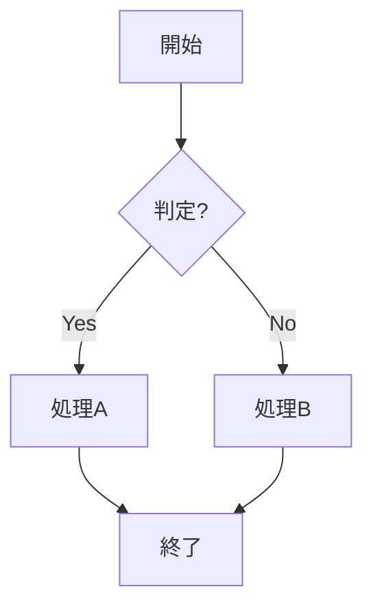
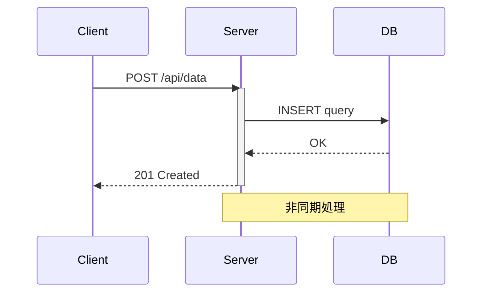
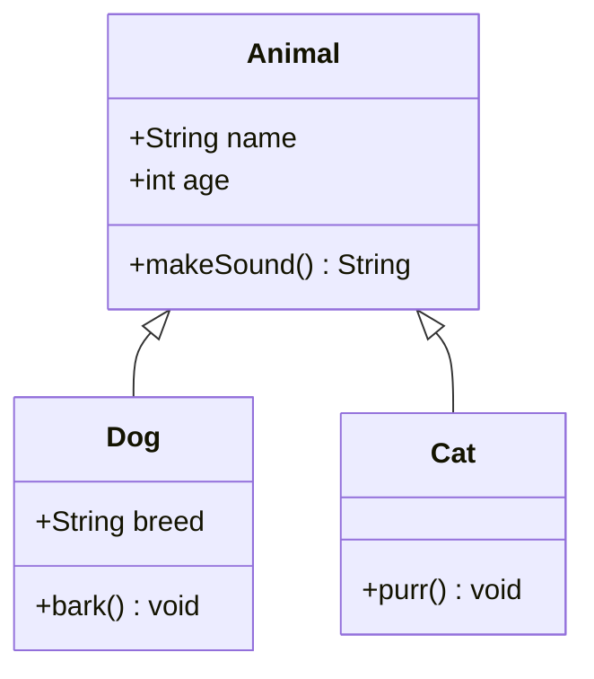
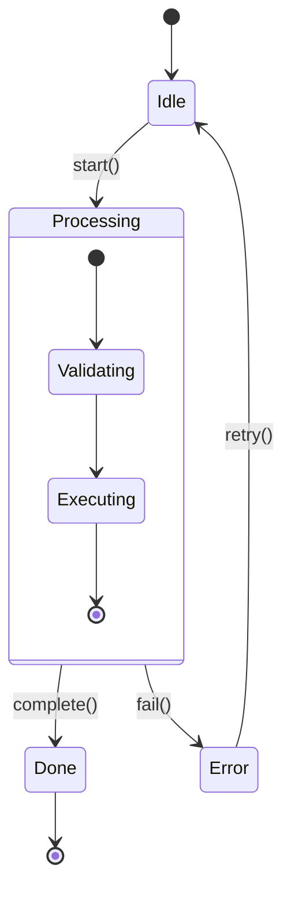
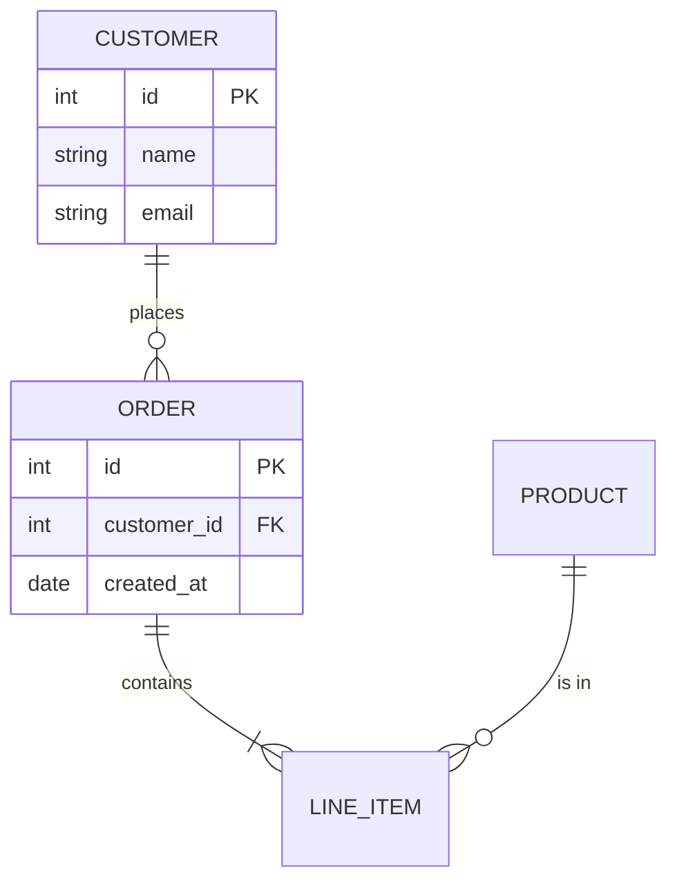
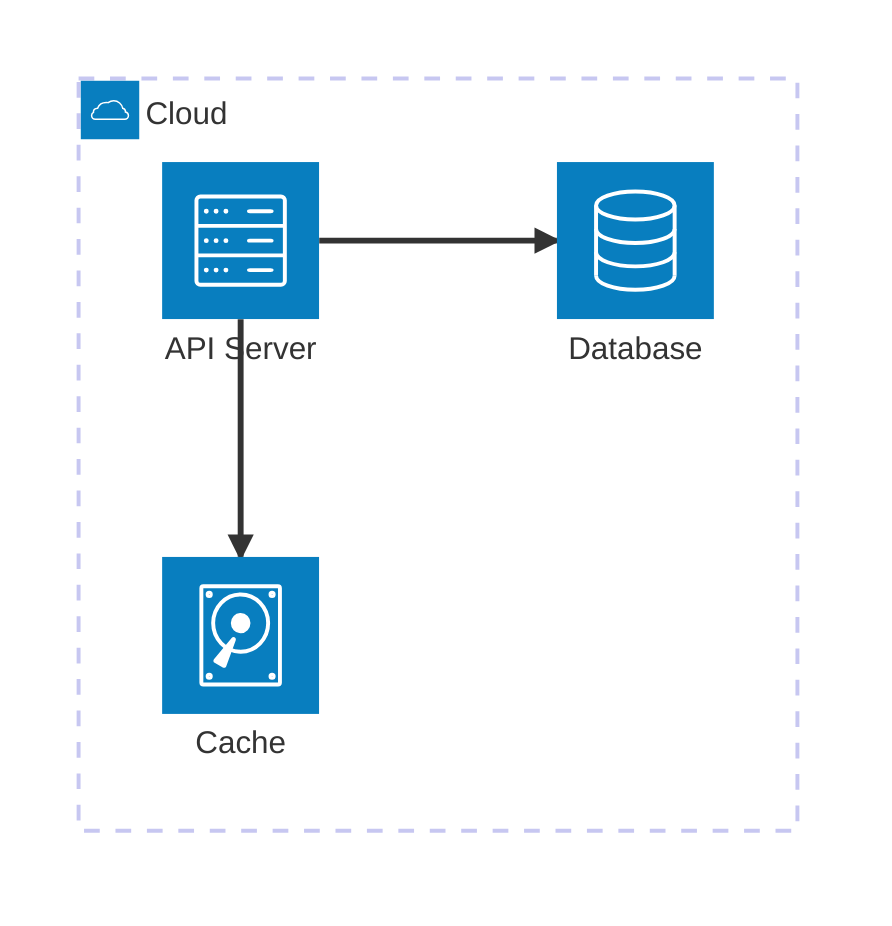

# Mermaid 図種別構文テンプレート

## Contents

- Flowchart
- Sequence Diagram
- Class Diagram
- State Diagram
- ER Diagram
- Architecture Diagram
- Gantt Chart
- Git Graph
- Pie Chart
- Quadrant Chart
- User Journey
- Kanban
- Mindmap
- Timeline
- XY Chart
- Sankey Diagram
- Block Diagram

## Flowchart

方向: `TD`(上→下), `LR`(左→右), `BT`(下→上), `RL`(右→左)

ノード形状:
- `A["矩形"]` — プロセス
- `B{"ダイヤモンド"}` — 判定
- `C(("円"))` — 接続点
- `D[("円筒")]` — データベース
- `E[["サブルーチン"]]` — サブプロセス
- `F(["スタジアム"])` — 端子

矢印:
- `-->` 実線矢印
- `---` 実線（矢印なし）
- `-.->` 点線矢印
- `==>` 太線矢印
- `-->|label|` ラベル付き

## Sequence Diagram

矢印:
- `->>` 実線（同期）
- `-->>` 点線（応答）
- `-x` 実線（失敗）
- `-)` 実線（非同期）

構文要素:
- `participant A as Label` — エイリアス
- `activate/deactivate` — ライフライン
- `Note over A,B: text` — ノート
- `alt/else/end` — 条件分岐
- `loop text/end` — ループ
- `par/and/end` — 並列処理

## Class Diagram

関係:
- `<|--` 継承
- `*--` コンポジション
- `o--` 集約
- `-->` 依存
- `..>` 実現

## State Diagram

## ER Diagram

カーディナリティ:
- `||--||` 1対1
- `||--o{` 1対多
- `}o--o{` 多対多

## Architecture Diagram

## Gantt Chart / Git Graph / Pie Chart / Quadrant Chart / User Journey / Kanban / Mindmap / Timeline / XY Chart / Sankey Diagram / Block Diagram

詳細は `diagram-templates-advanced.md` を参照。
