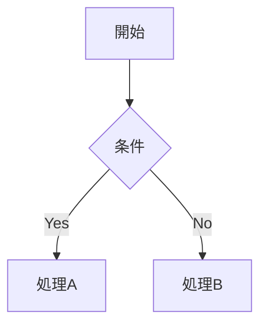

# Slidev 構文スニペット集（低頻度・応用）

## v-click 応用パターン

```html
<!-- 2項目ずつ表示 -->
<v-clicks :every="2">

- A
- B
- C
- D

</v-clicks>

<!-- 絶対位置指定（3クリック目で表示） -->
<div v-click="3">Show at click 3</div>

<!-- クリック後に非表示 -->
<div v-click.hide>クリックで非表示</div>
```

## v-motion（@vueuse/motion統合）

```html
<div
  v-motion
  :initial="{ x: -80 }"
  :enter="{ x: 0 }"
  :leave="{ x: 80 }"
>
  Slidev
</div>
```

クリックトリガー（v0.48.9+）:

```html
<div
  v-motion
  :initial="{ x: -80 }"
  :enter="{ x: 0, y: 0 }"
  :click-1="{ x: 0, y: 30 }"
  :click-2="{ y: 60 }"
>
  Slidev
</div>
```

## Monaco Editor

```
```ts {monaco}
console.log('HelloWorld')
```
```

Diff表示:

```
```ts {monaco-diff}
console.log('Original')
~~~
console.log('Modified')
```
```

## 画像配置

### グリッド配置

```html
<div class="grid grid-cols-2 gap-4">
  
  
</div>
```

### 絶対位置指定

```html

```

## LaTeX数式

```md
インライン: $E = mc^2$

ブロック:
$$
\int_0^\infty e^{-x^2} dx = \frac{\sqrt{\pi}}{2}
$$
```

KaTeX内蔵のため追加設定不要。

## Mermaidダイアグラム

````md

````

## マルチファイル構成

```md
---
src: ./sections/intro.md
---

---
src: ./sections/architecture.md
---
```

## Magic Move 追加設定

設定: `magicMoveDuration`（デフォルト800ms）、`magicMoveCopy`（コピーボタン: `'final'`推奨）

## コードハイライト 詳細例

### 行ハイライト

```
```ts {2,3}
function add(
  a: Ref<number> | number,   // ← ハイライト
  b: Ref<number> | number    // ← ハイライト
) {
  return computed(() => unref(a) + unref(b))
}
```
```

### クリックでハイライト変化

```
```ts {2-3|5|all}
function add(
  a: Ref<number> | number,
  b: Ref<number> | number
) {
  return computed(() => unref(a) + unref(b))
}
```
```

最初は2〜3行目 → 次のクリックで5行目 → 全行ハイライト。
