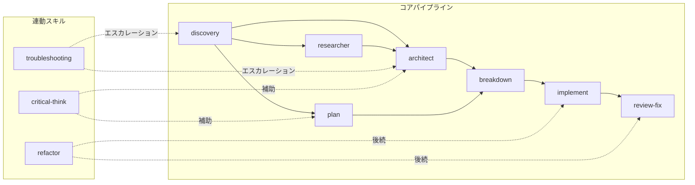

# DEV-CYCLE: 開発サイクル アーキテクチャ仕様

各スキルの実装詳細は各 SKILL.md を参照。本ドキュメントは SKILL.md 単体では読み取れない設計意図・スキル間のコナセンス（connascence）・暗黙の契約を記述する。

**更新タイミング**: コナセンスに該当する規約を変更したとき / コアパイプラインまたは連動スキルを追加・削除したとき / フェーズ境界の設計判断を変更したとき

## 1. サイクル全体像

**ルート選択**:
- **完全**: discovery → researcher(任意) → architect → breakdown → implement → review-fix
- **軽量**: plan → breakdown → implement（問題定義が明確で設計書不要な場合）
- **単体**: review-fix（実装後の独立レビュー）

## 2. フェーズ分割の設計意図

各フェーズ境界は「責務の質的な違い」で切っている。

| 境界 | なぜここで切るか |
|------|----------------|
| discovery → researcher/architect | 問題の言語化（対話）と解決策の設計（分析）は認知プロセスが異なる。問題が曖昧なまま設計に入るとXY問題を招く |
| researcher → architect | 外部情報収集（WebSearch/WebFetch）とコードベース設計は allowed-tools が排他的。researcher はコード変更不可、architect は外部検索不可 |
| architect → breakdown | What/Why（設計判断）と How（実装手順）の分離。設計書に実装詳細を混ぜると設計判断の検証が困難になる |
| breakdown → implement | タスク定義（静的）と実行制御（動的）の分離。implementation.md は読み取り専用の仕様源、implement はオーケストレーター |
| implement → review-fix | 実装者とレビュアーのコンテキスト分離。生成バイアスを排除するため、実装したエージェントとは別のエージェントがレビューする |

**architect vs plan**: architect は discovery.md を前提入力とし、3観点並列調査→2アプローチ対立案→opusレビューのフォーマルプロセスを踏む。plan はコードベース探索ベースの軽量版で、discovery を経由せず `$ARGUMENTS` から直接開始できる。breakdown は plan/architect どちらの生成ファイルも同一扱いする。

## 3. コナセンス・マップ

スキル間で仕様が連動している箇所。一方を変更すると他方も更新が必要になる。横断的変更時はここを起点に影響範囲を特定する。

### 強連動（変更時に複数ファイルを同時更新しないと壊れる）

| コナセンス | 連動箇所 | 壊れ方 |
|-----------|---------|--------|
| **ファイル命名** `YYYY-MM-DD-HHMMSS-{topic}.md` | 書き出し: 全コアスキル。読み込み: architect(discovery/), breakdown(plans/), implement(implement/) | 命名変更 → 読み込み側の「Glob後に名前降順で先頭」ロジックが最新ファイルを誤選択 |
| **成果物ディレクトリ契約** | 下表参照。書き出し側の claude-output-init.sh 引数 + 読み込み側の Glob パスが連動 | ディレクトリ名変更 → 生成側の init 引数、読み込み側の Glob パス、両方を更新しないとファイルが見つからない |
| **品質ゲート判定キー** `GATE: PASS/FAIL/SKIP` | 出力: quality-gate.sh。分岐: implement(品質ゲート, レビューサイクル), review-fix(品質ゲート), refactor(ステップ実行) | キー文字列変更 → 3スキルの分岐ロジックが判定不能。PASS後のフローが implement(次Phase進行)と review-fix(次レビューサイクル)で異なる点に注意。SKIP はコマンド未検出時に出力 |
| **変更検出判定キー** `RESULT: NO_CHANGES/CONFIG_ONLY/TOO_LARGE/PROCEED` | 出力: changed-files.sh。分岐: implement(対象ファイル特定), review-fix(対象ファイル特定) | キー追加/変更 → 2スキルの分岐に未処理パスが発生。注意: CONFIG_ONLY の扱いが implement(スキップ)と review-fix(中止報告)で微妙に異なる |
| **plans/ への二重書き込み** | 書き込み: plan, architect。読み込み: breakdown | breakdown は「名前降順で先頭」を無条件に読む。plan と architect を同日に実行すると意図しないファイルを参照する可能性がある |

**成果物ディレクトリの書き出し/読み込みマッピング**:

| ディレクトリ | 書き出し | 読み込み |
|------------|---------|---------|
| `.claude/discovery/` | discovery | architect（必須入力） |
| `.claude/research/` | researcher | architect（参照可能） |
| `.claude/plans/` | plan, architect | breakdown |
| `.claude/implement/` | breakdown | implement |
| `.claude/review/` | implement, review-fix | (最終成果物) |

### 中連動（方針・パターンの共有。変更時に全箇所の整合性確認が必要）

| コナセンス | 連動箇所 | 影響 |
|-----------|---------|------|
| **opusレビューパターン** | plan(品質検証), architect(品質検証), breakdown(タスク分解レビュー), implement(レビューサイクル), review-fix(レビュー) の5箇所 | 「ファイル書き出し後にコンテキスト分離でopusに委譲→Edit修正」という共通原則。廃止すると生成バイアスが混入。ただしレビュー観点は各スキル固有（設計品質 vs コード品質）で統一不要 |
| **コードレビュー高信号フィルタ** | implement(レビューサイクル) と review-fix(レビュー) の SKILL.md 本文に同一リストが重複記述。正規ソースは `_shared/review-criteria.md` | 一方のみ更新すると判定基準が分岐。`_shared/` を更新しても SKILL.md 本文の重複記述が残る |
| **サブエージェント必須4要素** | implement(タスク実行): コンテキスト/明示的指示/関連ファイルパス/成功基準。researcher(ソース調査): コンテキスト/指示/参照ソース/成功基準 | 同じ概念だが名称が不統一（「関連ファイルパス」vs「参照ソース」）。新スキル追加時にどちらを参照するか曖昧 |
| **全文転記ルール** | plan(設計検討, 注意事項), architect(設計検討) で各自記述 | 共有ルールだが `_shared/` に集約されていない。一方で緩和すると他方に波及するが、変更漏れに気づきにくい |
| **設計判断の問い** | architect(設計原則), plan(Phase 0) が `_shared/design-questions.md` を参照 | 問いの追加・削除時に正規ソースのみ更新すればよい。参照側は1行のポインタのみ |

## 4. 連動スキルの接続意図

| スキル | 接続先 | 種類 | なぜ接続するか |
|--------|-------|------|--------------|
| troubleshooting | → discovery, architect | エスカレーション | バグの根本原因が仕様誤解や設計前提の崩壊である場合、修正ではなく問題の再定義が必要。判定基準: 同箇所で過去にも類似バグ、または修正が3ファイル以上に波及 |
| critical-think | → plan, architect の検証 | 補助 | 設計案の前提を批評し論理的欠陥を抽出する。生成者自身のセルフレビューとは別に、ユーザーが能動的に深掘りしたい場合に使用 |
| refactor | → implement, review-fix | 後続 | refactor は計画生成(refactor-plan.md)まで。大規模な場合は implement でタスク実行、完了後は review-fix でレビュー。小規模なら refactor 自身が直接実行 |

## 5. 共通インフラの設計意図

スクリプトへの切り出し判断基準は `claude-global-skills.md`「スキル内処理の3層分離」を参照。

### 判定キーの設計背景

スクリプトの出力末尾に配置する `GATE:` / `RESULT:` キーは、スキル側の分岐ロジックとの契約。人間可読な出力の中から機械的に判定結果を抽出するためのプロトコル。キー文字列はコナセンス・マップの強連動に該当する。

| スクリプト | 判定キー | 設計意図 |
|-----------|---------|---------|
| quality-gate.sh | `GATE: PASS/FAIL/SKIP` | Lint/Test/Build の複合結果を集約。SKIP はコマンド未検出時 |
| changed-files.sh | `RESULT: NO_CHANGES/CONFIG_ONLY/TOO_LARGE/PROCEED` | レビュー不要ケースの早期スキップ。50ファイル超の TOO_LARGE はバッチ分割のトリガー |
| claude-output-init.sh | (判定キーなし) | 冪等なディレクトリ初期化。.gitignore で成果物を git 追跡対象外にする |
